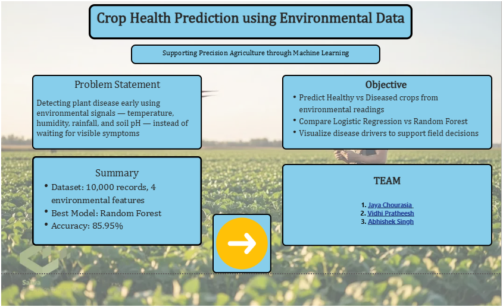
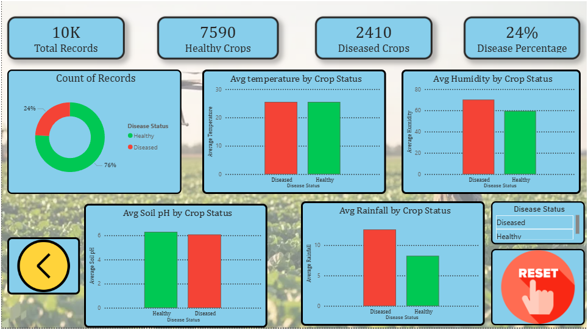

# 🌿 PlantGuard — Plant Disease Prediction from Environmental Data

> A machine learning project that predicts whether a crop is Healthy or Diseased using temperature, humidity, rainfall, and soil pH — comparing Logistic Regression and Random Forest, visualized through an interactive Power BI dashboard.


---

## 🧠 Tech Stack

| Layer            | Technology                                                                 |
|------------------|------------------------------------------------------------------------------|
| Data Processing  |   |
| ML Models        |  (Logistic Regression, Random Forest) |
| Visualization    |   |
| Environment      |  |
| Dashboarding     |  |

---

## 📁 Folder Structure

```
plant-disease-prediction/
├── CA2project_improved.ipynb        ← Main notebook (cleaned + corrected analysis)
├── dashboard1.pbix                  ← Power BI dashboard file
├── dashboard_img/                   ← Dashboard screenshots (Introduction + Main pages)
│   ├── intro.png
│   └── main.png
├── plant_disease_dataset.csv        ← Raw input dataset (10,000 records)
├── plant_disease_powerbi_export.csv ← Cleaned + feature-engineered data with predictions, for Power BI
├── images/                          ← Saved plots (EDA, feature importance, confusion matrices, etc.)
├── requirements.txt                 ← Python dependencies
├── .gitignore                       ← Ignores checkpoints, venv, cache, etc.
├── LICENSE                          ← MIT License
└── README.md
```

---

## ⚙️ How It Works

1. Load the raw environmental dataset (`temperature`, `humidity`, `rainfall`, `soil_pH`, `disease_present`).
2. Detect and fix anomalies (e.g. humidity readings above 100%) and cap outliers using the IQR method.
3. Run exploratory data analysis — distributions, correlation heatmap, feature-vs-disease boxplots.
4. Engineer new features (`temp_humidity_index`, `rainfall_level`, `soil_pH_deviation`) to expose non-linear/combined effects.
5. Split the data (80/20, stratified) and scale features — fitting the scaler **only on the training set** to avoid leakage.
6. Train and evaluate **Logistic Regression** and **Random Forest**, comparing Accuracy, Precision, Recall, and F1.
7. Export the final cleaned dataset with both models' predictions to CSV for Power BI dashboarding.
8. Build an interactive **Power BI dashboard** (KPIs, disease distribution, feature importance, environmental comparisons) so non-technical stakeholders can explore the results.

---

## 📊 Model Results

| Model | Accuracy | Precision | Recall | F1 Score |
|---|---|---|---|---|
| Logistic Regression | 0.781 | 0.608 | 0.251 | 0.355 |
| **Random Forest** | **0.864** | **0.779** | **0.608** | **0.683** |

**Random Forest wins** — it's substantially better at catching actual disease cases (recall), suggesting disease risk is threshold-driven (e.g. spikes past a rainfall/humidity point) rather than linear, a pattern tree-based splits capture but Logistic Regression cannot.


---

## 📈 Power BI Dashboard

The final predictions and engineered features were exported to `plant_disease_powerbi_export.csv` and built into a 2-page interactive Power BI dashboard.

**🔗 Live dashboard link:** _coming soon_

### Introduction Page
Project title, problem statement, objectives, dataset summary, and team credits.



### Main Dashboard Page
KPI cards (Total Records, Healthy Crops, Diseased Crops, Disease %), a Disease Distribution donut chart, and side-by-side comparisons of average Temperature, Humidity, Rainfall, and Soil pH between Healthy and Diseased crops — plus a Disease Status slicer for live filtering.



---

## 🧬 ML Concepts Used

- **Data Cleaning & Anomaly Detection** — physically impossible values, IQR-based outlier capping
- **Feature Engineering** — interaction terms, bucketed thresholds, deviation-from-neutral features
- **Train/Test Split with Stratification** — preserves the ~76/24 class imbalance across splits
- **Feature Scaling without Leakage** — `StandardScaler` fit on training data only
- **Feature Importance** — Random Forest importances computed post-split
- **Classification Models** — Logistic Regression (linear baseline) vs Random Forest (non-linear)
- **Evaluation Metrics** — Accuracy, Precision, Recall, F1, Confusion Matrix
- **BI Dashboarding** — DAX measures, KPI cards, interactive slicers built in Power BI

---

## 🛠️ How to Run

### 1. Clone the repo
```bash
git clone https://github.com/abhii026/plant-disease-prediction.git
cd plant-disease-prediction
```

### 2. Run the ML Notebook
```bash
pip install -r requirements.txt
jupyter notebook CA2project_improved.ipynb
```
Run all cells top to bottom. Make sure `plant_disease_dataset.csv` is in the same folder as the notebook.
- All EDA/model plots are saved automatically to the `images/` folder.
- The final dataset with predictions is saved as `plant_disease_powerbi_export.csv`, ready to load into Power BI.

### 3. Open the Power BI Dashboard
1. Install [Power BI Desktop](https://www.microsoft.com/en-us/power-platform/products/power-bi/desktop) (free, Windows only).
2. Open **`dashboard1.pbix`** directly in Power BI Desktop.
3. If prompted to refresh data, click **Refresh** on the Home ribbon — this reloads `plant_disease_powerbi_export.csv` into the model.
4. Use the **Disease Status slicer** on the Main page to filter the dashboard live between Healthy and Diseased crops.
5. To export a static copy: **File → Export → Export to PDF**.

---

## ✅ What We Got (Key Outcomes)

- **10,000 crop records** analyzed across 4 environmental features (temperature, humidity, rainfall, soil pH).
- Dataset is **imbalanced**: ~76% Healthy vs ~24% Diseased — an important context for interpreting model accuracy.
- **Random Forest was the best model**, reaching **85.95% accuracy**, clearly outperforming Logistic Regression — especially on recall, meaning it catches far more true disease cases.
- **Soil pH was the most influential feature** (importance ≈ 0.30), followed by Temperature (≈0.25), Rainfall (≈0.24), and Humidity (≈0.22) — soil chemistry mattered more to disease risk than any single weather variable.
- Diseased crops, on average, showed **higher temperature, higher humidity, higher soil pH, and lower rainfall** compared to Healthy crops — turning the model's internal logic into a plain-language pattern anyone can read.
- All of the above was packaged into a **2-page interactive Power BI dashboard** (Introduction + Main insights), making the model's findings usable by non-technical stakeholders like farm managers, not just data scientists.

---

## 📦 Requirements

```
pandas
numpy
matplotlib
seaborn
scikit-learn
jupyter
```

Install all with:
```bash
pip install -r requirements.txt
```

---

## 👨‍💻 Authors

- **[Jaya Chourasia](https://github.com/Jaya0925)**
- **[Vidhi Pratheesh](https://github.com/Vidhiiiiiiiii)**
- **[Abhishek Singh](https://github.com/abhii026)**

CA2 Project — Data Analytics / Machine Learning

---

## 📄 License

This project is licensed under the **MIT License**. See the [LICENSE](LICENSE) file for details.

---

## 🙏 Thank You

Thank you for checking out this project!

If you found it helpful, consider giving it a ⭐ on GitHub. Your support is appreciated and encourages future improvements.

Happy Coding! 🚀🌿
